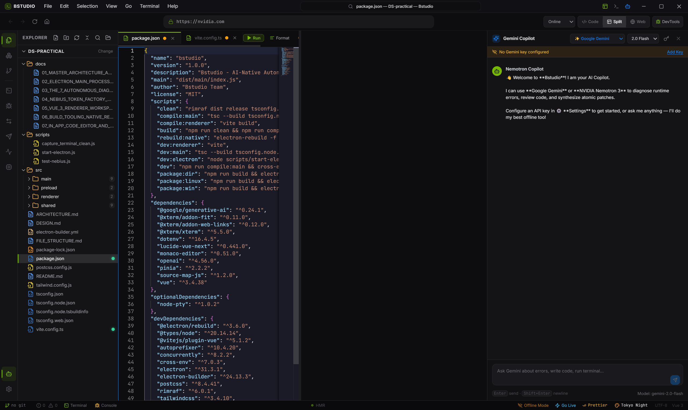
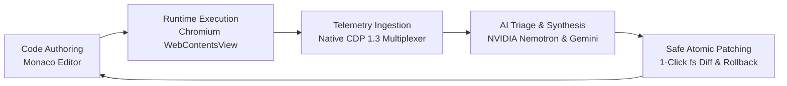
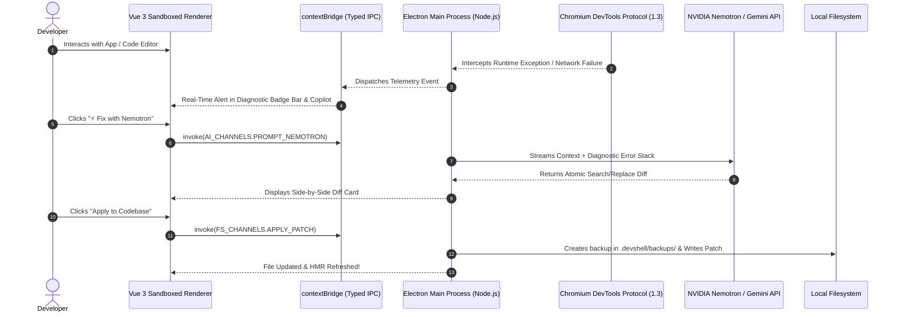

<div align="center">

# ⚡ Bstudio
### AI-Native Autonomous Diagnostic Browser & IDE for Full-Stack Developers

[](https://electronjs.org/)
[](https://vuejs.org/)
[](https://vitejs.dev/)
[](https://www.typescriptlang.org/)
[](https://microsoft.github.io/monaco-editor/)
[](https://tailwindcss.com/)
[](https://build.nvidia.com/)
[](https://ai.google.dev/)
[](https://opensource.org/licenses/MIT)
[](https://github.com/)

<p align="center">
  <b>Bstudio consolidates the entire modern web development toolchain into a single, high-performance desktop application.</b><br/>
  It unifies native terminal sessions, an in-app Monaco code editor, direct Chrome DevTools Protocol (CDP) telemetry, an API testing suite, and dual-tier AI reasoning powered by <b>NVIDIA Nemotron 3</b> and <b>Google Gemini 2.0</b>.
</p>

<p align="center">
  <a href="#-key-features"><b>Key Features</b></a> •
  <a href="#-system-architecture"><b>Architecture</b></a> •
  <a href="#-quick-start"><b>Quick Start</b></a> •
  <a href="#-dual-tier-ai-pipeline"><b>Dual-Tier AI</b></a> •
  <a href="#-keyboard-shortcuts"><b>Shortcuts</b></a> •
  <a href="#-packaging--distribution"><b>Packaging</b></a> •
  <a href="#-documentation"><b>Docs</b></a>
</p>

---



</div>

---

## 💡 The Problem & The Bstudio Vision

Traditional web development workflows force developers into an exhausting cycle of context-switching:
- 🔁 **Bouncing between 5+ separate windows:** VS Code / Cursor for editing, Chromium for testing, Chrome DevTools for debugging, Postman for API testing, and standalone terminal windows.
- 🐌 **Heavy AI Overhead & Fragile Protocol Handshakes:** Generic Model Context Protocol (MCP) servers introduce complex stdio process spawning, JSON-RPC serialization, and token latency.
- ⚠️ **Blind Code Generation:** Frontier models write code without awareness of live runtime console errors, hydration mismatches, network waterfall bottlenecks, or memory leaks.

### The Bstudio Solution:
> **Bstudio fuses authoring, runtime execution, live Chromium telemetry, and atomic remediation into a single hardware-accelerated desktop cockpit.**



---

## ✨ Key Features

### 💻 1. Professional Monaco Code Editor
- **VS Code Experience:** Powered by Monaco Editor (`v0.51.0`) with multi-file tabs, dirty state indicators, minimap, line numbers, and breadcrumbs.
- **Language Intelligence:** Pre-configured syntax highlighting and snippet providers for **TypeScript, JavaScript, Vue 3 SFCs, Python, JSON, HTML, CSS, and Markdown**.
- **Vite Web Workers:** Standalone web worker threading for zero-latency background syntax validation, schema validation, and IntelliSense.
- **Curated Themes:** Switch dynamically between **One Dark Pro**, **Tokyo Night**, **GitHub Dark**, and **GitHub Light**.
- **Keyboard Productivity:** Built-in formatter (`Shift+Alt+F`), fast file save (`Ctrl+S`), and quick code running.

### 📁 2. File Explorer with Vertical Guide Lines
- **Hierarchical Tree View:** Smooth chevron folder expand/collapse animations with persistent state.
- **Indentation Guides:** Subtle vertical tree alignment lines making deep directory nesting easy to read.
- **Live Status Dots:** Real-time visual indicators showing active file focus and background open tabs.
- **Safe Operations:** Right-click context menus for creating files/folders, deleting, renaming, and revealing in system explorer.

### 🌐 3. Chromium Web View with Native CDP Telemetry
- **Chromium DevTools Protocol (`v1.3`):** Direct WebSocket connection into Chrome engine domains: `Security`, `Network`, `DOM`, `Runtime`, `HeapProfiler`, and `Performance`.
- **Zero Scraping:** Intercepts uncaught runtime exceptions, SSR hydration failures, unhandled promise rejections, and CSP violations straight from the browser kernel.
- **Diagnostic Badge Bar:** Real-time status indicators in the chrome bar alerting you instantly to console errors, network failures, or security blocks.

### 🧠 4. Dual-Tier AI Reasoning Engine
- **Nemotron 3 Nano (Streaming Triage):** Ultra-low latency stream filtering over incoming CDP telemetry. Identifies and categorizes anomalies without burning token budget.
- **Nemotron 3 Ultra (Deep Code Synthesis):** Escalated on-demand to perform architectural reasoning, root-cause diagnostics, and generate production-grade code patches.
- **Google Gemini 2.0 Flash Integration:** Fast conversational debugging, terminal command explanation, and general reasoning.
- **Encrypted BYOK Security:** All API keys are securely encrypted at rest using Electron's native `safeStorage` (Windows DPAPI / Linux Secret Service).

### ⚡ 5. Safe 1-Click Atomic Codebase Patching
- **Zero-MCP Overhead:** Native Node.js execution applies atomic search-and-replace patches straight to disk.
- **Safety First:** Creates automatic snapshot backups under `.devshell/backups/` before any file write.
- **Interactive Diff Inspection:** Visual side-by-side diff card before committing changes.
- **1-Click Rollback:** Revert any patch instantly if the runtime behavior doesn't match expectations.

### 🖥️ 6. Hardware-Accelerated Terminal (`node-pty` + xterm.js)
- Native pseudoterminal integration supporting **PowerShell**, **Command Prompt**, and **bash/zsh**.
- Full ANSI color palettes, resize fit addon, and interactive hyperlinks.
- Multi-session management with dedicated tabs.

### 🔌 7. VS Code Extensions Hub
- Curated marketplace view of top VS Code extensions (Prettier, ESLint, GitLens, Python, Tailwind CSS IntelliSense, Docker, Rust Analyzer).
- View installed extensions, toggle activations, and customize workspace behavior.

### 🧪 8. Smart cURL & Multi-Threaded Load Studio
- Built-in visual API client with support for headers, JSON payloads, query parameters, and instant code generation.
- Integrated worker thread pool for concurrent HTTP/HTTPS load testing with live latency percentiles (p50, p95, p99).

---

## 🏗️ System Architecture

Bstudio enforces strict multi-process isolation between the privileged Node.js main process and the sandboxed Chromium UI renderer.

```
+-----------------------------------------------------------------------------------------------+
|                                      BSTUDIO WORKSPACE                                        |
|                                                                                               |
|  +-------------------------------------------------------------+  +------------------------+  |
|  |                   TOP WINDOW CHROME (TopNavbar)             |  |   AI COPILOT SIDEBAR   |  |
|  | [BSTUDIO Menu] [Window Title Drag Area] [Layout] [Controls] |  |                        |  |
|  +-------------------------------------------------------------+  | - Real-time CDP Stream |  |
|  |                      OMNIBAR (Browser Nav)                  |  | - Nemotron 3 Reasoning |  |
|  | [← → ⟳] [URL Input: https://...] [Device Toggle] [Badges]   |  | - Gemini 2.0 Flash     |  |
|  +-------------------------------------------------------------+  | - Interactive Diffs    |  |
|  |                 SPLIT WORKSPACE CONTAINER                   |  | - 1-Click "Apply Diff" |  |
|  |  +----------------------------+  +-----------------------+  |  | - BYOK Key Manager     |  |
|  |  |     FILE EXPLORER &        |  |   LIVE BROWSER VIEW   |  |  |                        |  |
|  |  |     MONACO CODE EDITOR     |  |   (WebContentsView)   |  |  +------------------------+  |
|  |  |                            |  |                       |  |  |    BOTTOM DRAWERS      |  |
|  |  |  - Multi-tab file manager  |  |  - Real Chromium      |  |  |                        |  |
|  |  |  - Syntax & IntelliSense   |  |  - Device Emulation   |  |  |  - xterm.js Terminal   |  |
|  |  |  - Auto-format & Runner    |  |  - Hardware Accelerated| |  |  - Chrome DevTools Console|
|  |  +----------------------------+  +-----------------------+  |  |  - Network Waterfall   |  |
|  +-------------------------------------------------------------+  |  - Load Testing Studio |  |
|  |                 STATUS BAR (Branch, Diagnostics, Themes)     |  |  - Memory Profiler     |  |
|  +-------------------------------------------------------------+  +------------------------+  |
+-----------------------------------------------------------------------------------------------+
```

### Process Isolation Model:


---

## 📊 Feature Comparison

| Capability | Bstudio | VS Code + Chrome | Cursor | Generic Web IDE |
| :--- | :---: | :---: | :---: | :---: |
| **Integrated Chromium View** | ✅ Native (WebContentsView) | ❌ Separate Window | ❌ No Browser | ⚠️ Laggy iframe |
| **Direct CDP Socket Telemetry** | ✅ Full Kernel Access | ⚠️ Manual DevTools | ❌ None | ❌ None |
| **Dual-Tier AI Routing** | ✅ Nemotron Nano + Ultra | ❌ Single Model | ❌ Single Model | ❌ Single Model |
| **Monaco Code Editor Built-in** | ✅ Yes (`v0.51.0`) | ✅ Primary | ✅ Primary | ⚠️ Web version |
| **Zero-MCP Atomic Patching** | ✅ High-speed in-process | ❌ Slow stdio MCP | ⚠️ Proprietary | ❌ None |
| **Auto Backup & 1-Click Rollback**| ✅ `.devshell/backups/` | ❌ Git manual | ⚠️ Partial | ❌ None |
| **Native PTY Terminal** | ✅ `node-pty` + xterm.js | ✅ Built-in | ✅ Built-in | ⚠️ Emulated |
| **Multi-Thread Load Tester** | ✅ Integrated Worker Pool | ❌ Separate Tool | ❌ None | ❌ None |
| **Encrypted BYOK Key Security** | ✅ Native `safeStorage` | ⚠️ Extensions | ⚠️ Cloud Account | ❌ Cleartext |

---

## 🚀 Quick Start

### Prerequisites
- **Node.js:** v18.x or v20.x
- **Python:** 3.10+ (Required for native node-gyp module building)
- **Windows:** Visual Studio C++ Build Tools (`Desktop development with C++`)
- **Linux:** `sudo apt-get install build-essential python3 make gcc g++ libx11-dev libxkbfile-dev`

### Installation

```bash
# 1. Clone the repository
git clone https://github.com/your-username/bstudio.git
cd bstudio

# 2. Install dependencies
npm install

# 3. Rebuild native binaries (node-pty for your system)
npm run rebuild:native
```

### Environment Configuration

Create a `.env` file in the project root:

```env
# NVIDIA Nebius Token Factory (Nemotron 3 Models)
NEBIUS_API_KEY=nvapi-your-nebius-token-factory-credential
NEBIUS_BASE_URL=https://api.tokenfactory.nebius.com/v1/

# Google Gemini API (Optional)
GEMINI_API_KEY=your-gemini-api-key

# Workspace & Server Settings
WORKSPACE_ROOT=.
PORT=5173
```

> **Note:** You can also enter API keys directly in the app UI via **Help → AI Provider Keys** or the Settings gear icon. All keys are encrypted locally using OS-level DPAPI / Secret Service.

### Running in Development Mode

```bash
# Launch concurrent Vite HMR and Electron main process
npm run dev
```

---

## ⌨️ Keyboard Shortcuts

| Shortcut | Action | Scope |
| :--- | :--- | :--- |
| <kbd>Ctrl</kbd> + <kbd>S</kbd> | Save current active file | Code Editor |
| <kbd>Shift</kbd> + <kbd>Alt</kbd> + <kbd>F</kbd> | Auto-format document (Prettier engine) | Code Editor |
| <kbd>Ctrl</kbd> + <kbd>O</kbd> | Open File dialog | Global |
| <kbd>Ctrl</kbd> + <kbd>Shift</kbd> + <kbd>O</kbd> | Open Folder / Project workspace | Global |
| <kbd>Ctrl</kbd> + <kbd>`</kbd> | Toggle Terminal Drawer | Global |
| <kbd>Ctrl</kbd> + <kbd>I</kbd> | Toggle AI Copilot Sidebar | Global |
| <kbd>Ctrl</kbd> + <kbd>,</kbd> | Open Settings / AI Provider Key Modal | Global |
| <kbd>F12</kbd> | Toggle Native Chromium DevTools | Global |
| <kbd>Alt</kbd> + <kbd>F4</kbd> | Close Application | Global |

---

## 📦 Packaging & Distribution

Bstudio builds ready-to-distribute standalone installers and portable executables via `electron-builder`:

### Windows
```bash
npm run package:win
```
- **Output:** 
  - `release/Bstudio-Setup-1.0.0.exe` (NSIS Installer with desktop & start menu shortcuts)
  - `release/Bstudio-1.0.0-portable.exe` (Zero-install standalone executable)

### Linux
```bash
npm run package:linux
```
- **Output:**
  - `release/Bstudio-1.0.0.AppImage` (Universal Linux binary)
  - `release/bstudio_1.0.0_amd64.deb` (Debian/Ubuntu package)

---

## 🎯 5-Minute Hackathon Demo Script

Follow this step-by-step path to demonstrate Bstudio's superpowers to judges or developers:

1. **Launch Workspace:** Run `npm run dev` or open the packaged `Bstudio.exe`. Show the VS Code style top menu, the draggable title bar, Monaco code tabs, and the integrated browser viewport.
2. **Open a Project:** Click `File → Open Folder...` and select any local project. Expand folders in the File Explorer to showcase vertical indentation guides and folder animation.
3. **Open & Edit Code:** Click `package.json` or `App.vue`. Highlight syntax coloring, line numbers, and format code with <kbd>Shift</kbd>+<kbd>Alt</kbd>+<kbd>F</kbd>.
4. **Trigger Runtime Exception:** In the browser view, navigate to a local dev server or test URL. Watch the diagnostic bar instantly flag the error with line number and source map resolution.
5. **AI Remediation:** In the Dev Copilot, click **"⚡ Fix with Nemotron"**. Watch Nemotron stream an explanation and generate an atomic code diff.
6. **Apply & Verify:** Click **"Apply to Codebase"**. Notice the backup created in `.devshell/backups/`, the file updated on disk, and the browser hot-reloading with the bug eliminated!
7. **Stress Testing:** Open the bottom drawer, switch to **Load Testing Studio**, and run a 50-user concurrent load test against your endpoint to see real-time latency charts.

---

## 📚 Deep-Dive Technical Documentation

Comprehensive documentation covering every layer of the Bstudio platform is available in the [`docs/`](docs/) directory:

- 📖 [**01 Master Architecture & System Topology**](docs/01_MASTER_ARCHITECTURE_AND_SYSTEM_TOPOLOGY.md)
- 🔌 [**02 Electron Main Process, WebContentsView & CDP Core**](docs/02_ELECTRON_MAIN_PROCESS_WEBCONTENTSVIEW_AND_CDP_CORE.md)
- 🧪 [**03 The 7 Autonomous Diagnostic & Load Engines**](docs/03_THE_7_AUTONOMOUS_DIAGNOSTIC_AND_LOAD_ENGINES.md)
- 🧠 [**04 Nebius Token Factory Dual-Tier Routing & Atomic Patch Engine**](docs/04_NEBIUS_TOKEN_FACTORY_NEMOTRON_DUAL_TIER_ROUTING_AND_ATOMIC_FILE_PATCHER.md)
- 🎨 [**05 Vue 3 Renderer Workspace, Dev Chat & Component Architecture**](docs/05_VUE_3_RENDERER_WORKSPACE_DEV_CHAT_SIDEBAR_AND_UI_COMPONENTS.md)
- 🔨 [**06 Build Tooling, Native Modules & Multi-Platform Packaging**](docs/06_BUILD_TOOLING_NATIVE_REBUILD_PACKAGING.md)
- 💻 [**07 In-App Code Editor & Native DevTools Integration**](docs/07_IN_APP_CODE_EDITOR_AND_NATIVE_DEVTOOLS_INTEGRATION.md)
- 📐 [**DESIGN.md**](DESIGN.md) - Complete design system, colors, typography, and UX guidelines.
- 🏛️ [**ARCHITECTURE.md**](ARCHITECTURE.md) - System axioms, security isolation, and IPC specifications.
- 🗂️ [**FILE_STRUCTURE.md**](FILE_STRUCTURE.md) - Annotated directory tree and file responsibilities.

---

## 🛡️ Security & Privacy

- **Safe Storage:** All API tokens (Nebius / Gemini) are encrypted using OS credential managers (`DPAPI` on Windows, `Secret Service` on Linux, `Keychain` on macOS).
- **Process Isolation:** The renderer process runs with `contextIsolation: true`, `nodeIntegration: false`, and `sandbox: true`.
- **Pre-Patch Snapshots:** Every file modification creates a timestamped backup before writing to disk.

---

## 📄 License

This project is licensed under the **MIT License** - see the [LICENSE](LICENSE) file for details.

<div align="center">
  <sub>Built with ❤️ for full-stack engineers and autonomous AI-assisted development.</sub>
</div>
